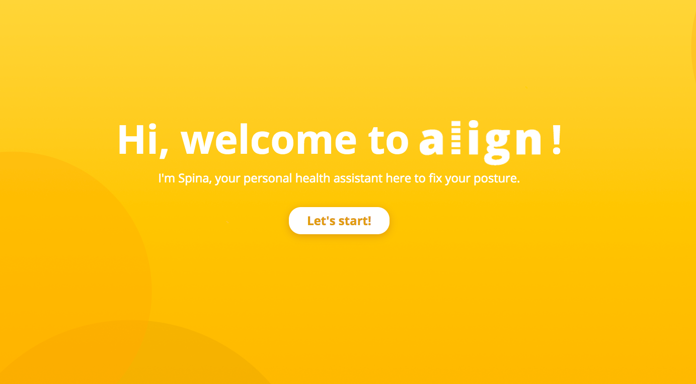
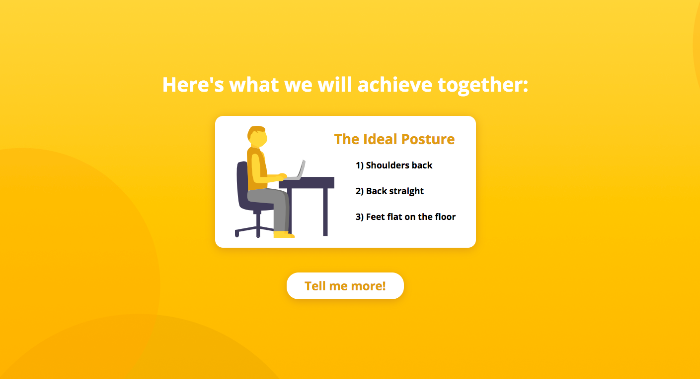
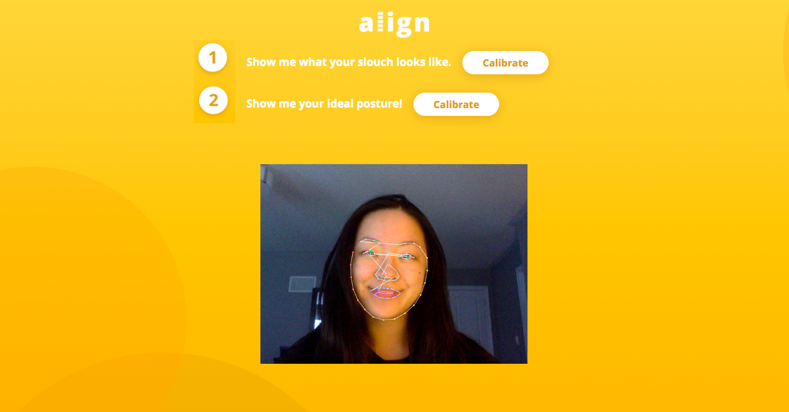

# Align
## A web app that fixes posture with three clicks - built at StarterHacks 2020!

Align is a web application that gives computer-users a personal posture-fixing health assistant. This is done by calibrating good posture against bad posture and tracking up and down movement of the chin with a real-time motion tracking JavaScript library as users work. 

